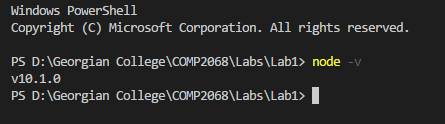

# Lab 1 - Chris Dyck

## Question 4
```js

var food = fs.readFile('food.txt', 'utf8', function(err, food){
    if(err){
        console.log(err);
    } else {
        console.log(food);
    }
})

```

## Question 5
require('http') is used to include the ________ ?

## ** ANSWER: **  http module

For more information go to https://www.w3schools.com/nodejs/nodejs_http.asp

## Question 8 / 9
# 2 Questions I still have are...
* I am not very familiar with git, can you talk a little more about this?
* Are ther alternatives to NodeJS?

## Question 10


